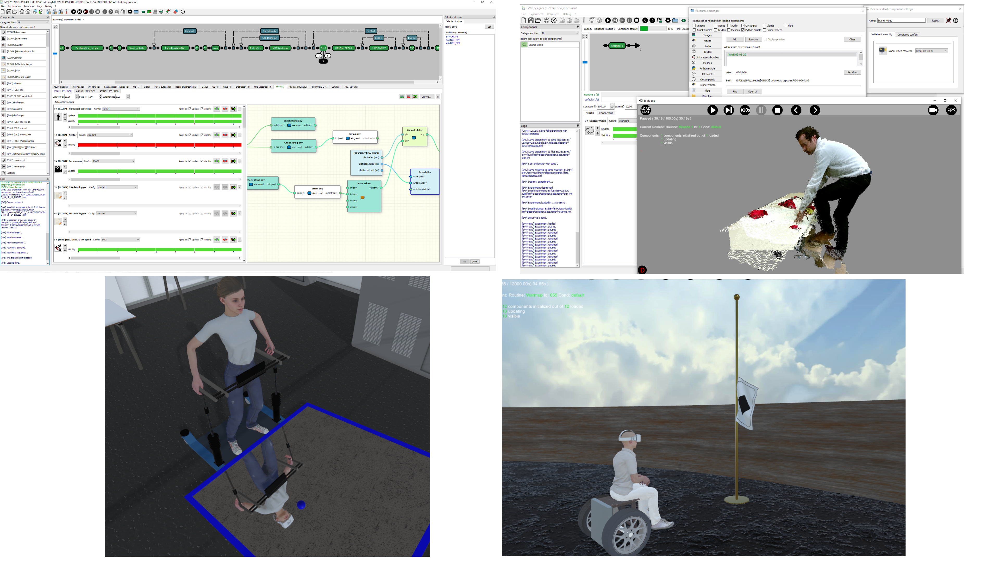

# ExVR - Open Virtual Psychology

## Summary

* [Description](#description)
* [Content](#content)
* [How to download](#how-to-download)
* [How to use](#how-to-use)
* [How to compile from code](#how-to-compile-from-code)
* [Medias](#medias)
* [Authors](#authors)

## Description

ExVR is a solution for creating and executing 3D/2D experiments using VR or not. Its philosophy is roughly similar to [Psychopy](https://www.psychopy.org/) and can easily be extended by users using scripting (C#) or visual scripting (with nodes).

It is subdivided in two software: 
  *	the designer GUI for creating the experiment content and its randomization
  *	the experiment launcher for that will generate and execute experiments at runtime using Unity3D

They both communicate between themselves and makes easy to operate changes and see immediately the results.
Once the design done, the user can then share the full experiment by exporting it, allowing accurate replications on others computers.

The project has been developped at [EPFL LNCO laboratory](https://www.epfl.ch/labs/lnco/) (Laboratory of Cognitive Neuroscience) and has been funded by the [EPFL Open Science Fund](https://www.epfl.ch/research/open-science/in-practice/open-science-fund/) from the 2019 cohort. It has been used for dozains of experiments and demos inside LNCO or during external collaborations since its creation in 2018.

  

## Content

**ExVR** is subdivided in two software:
* **ExVR-designer**: a GUI for creating the experiments and controlling their execution
  * creation
    * experimental flow with routines for content and loops for randomization
    * components, configurations and their parameters
    * a wide range of advanced randomization settings
    * management of resources (scripts, images, sounds, 3D objects..)
    * actions (association of conditions and components using update/visibility timelines)   
    * scripting using C#
    * visual scripting using nodes for linking components
    * global settings (display options and others)
    * generation of the differents randomizations instances for each subjet
    * saving/eport/loading functions
  * execution
    * load current exp (or a subpart) to the launcher
    * load default or specific randomization (using instance files)
    * play/pause/stop/next/previous/goto
    * feedback (exp state, time, routine name, nodes states...) from the exp-launcher
    * logs (messages, errors) from the software and the scripts
    * realtime update of components parameters
* **ExVR-exp**: an exp launcher for executing experiments
  * runtime generation for experiments from two xml files generated by the designer:
    * experiment file -> for the content
    * instance file  -> for the randomization
  

## How to download

* [Click here to download the last public release](https://github.com/BlankeLab/ExVR/releases/download/1.0b6/exvr-designer-1.0b6.zip)
* [Others releases or assets](https://github.com/BlankeLab/ExVR/releases)

## How to use

* [Documentation](cpp-projects/_build/bin/exvr-designer/data/documentation/doc_general.md)
* [Examples](cpp-projects/_build/bin/exvr-designer/data/experiments/examples/doc_examples.md)
* [FAQ](cpp-projects/_build/bin/exvr-designer/data/documentation/faq.md)
* [Experiment files directory](cpp-projects/_build/bin/exvr-designer/data/experiments/examples)
* [Resolved issues](https://github.com/BlankeLab/ExVR/issues?q=is%3Aissue+is%3Aclosed)
* [Pending issues](https://github.com/BlankeLab/ExVR/issues?q=is%3Aopen+is%3Aissue)

## How to compile from code

 * Visual Studio 2022 Version 17.4 (or newer) is requested for compiling, you can get it [here](
https://visualstudio.microsoft.com/vs/community/). 

 * The project is using QtCreator qmake files and the Qt library (Qt 6.5), you can get the opensource version [here](https://www.qt.io/download-thank-you).

 * Clone the project.
 * Open a command prompt, go to exvr directory and execute install_dependencies.cmd script, this will download and install the various dependencies for this project and toolset subproject
 * Open QtCreator
 * Setup a kit to use MSVC2019 compiler (amd64) with the Qt 6.5 msvc2019_64 qmake exe file (Qt/6.5.0/msvc2019_64/bin/qmake.exe)
 * Open exvr-all-exvr.pro project file
    * Setup a release config with ./exvr as working directory
    * Wait for indexing process (only first time)
    * Execute qmake on all-exvr project in the projects window
    * Launch compilation on all-exvr project in the projects window
    * Every subject project should have been compiled, so you can start them from QtCreator or by directly launching the relevant exe files
       * exvr/cpp-projects/_build/bin
          * exvr-designer/exvr-designer.exe (exvr gui designer program)
          * exvr-tests/exvr-test.exe (unit testing for exvr project)
          * exvr-export/exvr-export.dll (necessary for some ExVR components, copy it to exvr\unity-projects\exp-launcher for access from the unity editor of the ExVR exp launcher program and to exvr\cpp-projects\_build\bin\exvr-designer\exp-launcher for its built version)
       * exvr/toolset/cpp-projects/_build/bin
          * base-tests (unit testing for the toolset sub-project)
          * k4-scaner-grabber (program for reading frames from a kinect azure device)
          * k4-scaner-manager (program for reading frames from a network of kinect azure devices)
          * demos/demos.exe (samples program for the toolset sub-project)              

## Medias

LNCO ExVR Workshop 2022:

## Authors

[Florian Lance](https://www.linkedin.com/in/florian-lance/)
