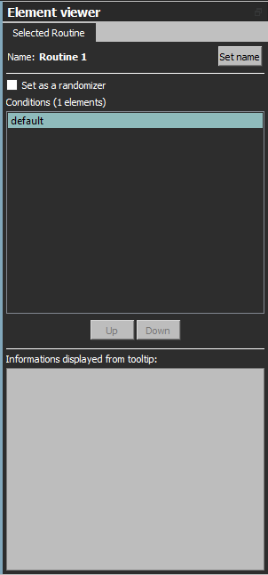
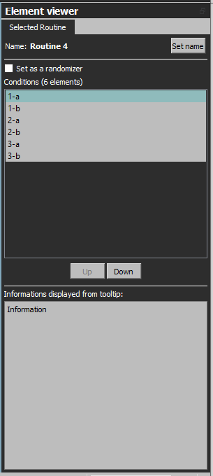
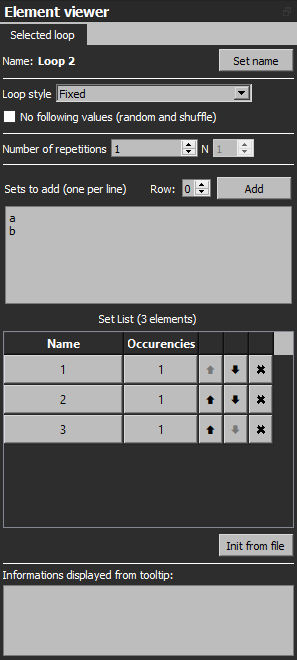
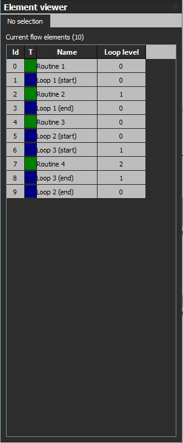

Previous page: [Flow creation](doc_ui_flow_creation.md)
 

# Element selection

When you select a specific element in the flow, informations relative to it will be displayed on the element viewer panel.

## Routine

From top to bottom:

* Name of the routine, you can change it by clicking ont the "Set name" button
* "Set as a randomizer" for transforming the routine in a randomizer or the inverse (if you do so, every condition will be cleaned as a randomizer is always empty)
* Conditions list: display the different conditions available, if the routine is not inside a loop, it will only have a "default" condition.
* Up/Down buttons: you can change the order of the displayed conditions by clicking on theses buttons (it will only be visual and not change the behaviour of the randomization)
* Informations displayed from tooltip: you can set here the text you want to display if you hover the routine with the mouse in the flow creation part.

## Loop

...

## Randomizer

...

## No selection

...

 

Next page: [Components list](doc_ui_component_list.md)