# Experiment flow creation

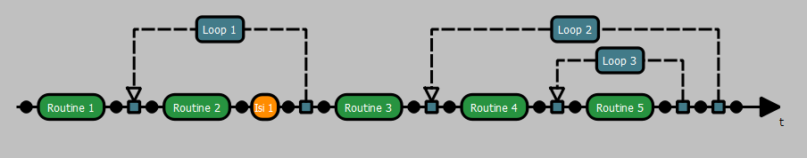

The flow creation panel is the place where you can define the structure of your experiment by placing elements on the arrow.
You have 3 differents available elements:

## Routine

The ba

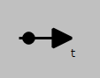
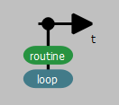
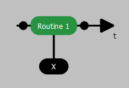
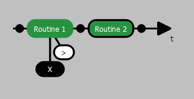
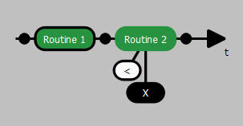
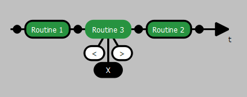
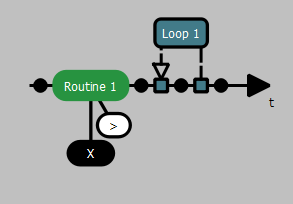
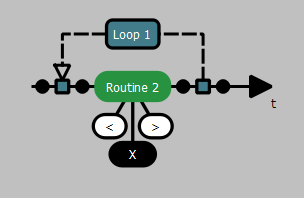
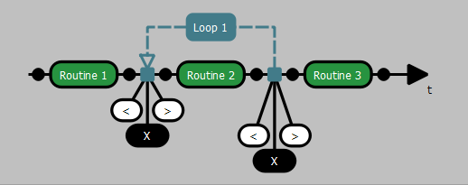
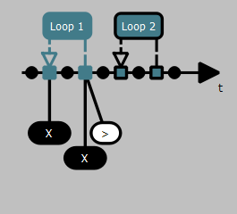
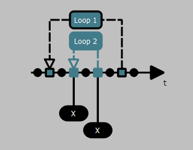
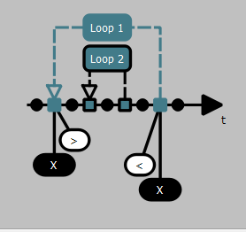
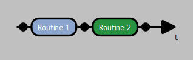
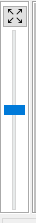

