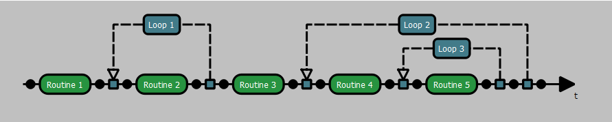
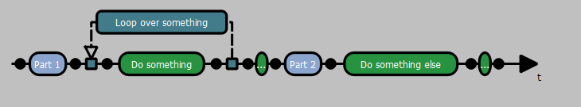
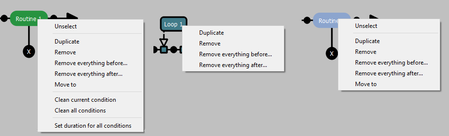
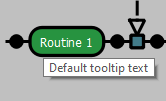

Previous page: [Index](doc_general.md)
 

# Flow creation

 
 
 
The flow creation panel is the place where you can define the structure of your experiment by placing elements on the arrow.
You have 3 differents available elements:

For adding a new element, first you need to chosse a node:

 

Then click on the black ball, it will display 2 differents choices:

 

You can either validate a choice by clicking on the corresponding button or canceling it by clicking anywhere on the grey part.

 

Here a [routine](doc_ui_element_selection.md#routine) has been created.
The [routine](doc_ui_element_selection.md#routine) is the base container used in experiments, it contains conditions which number depends from its position inside loops. When created outside a loop they only contains a "default" condition.

 

You can easily move any [routine](doc_ui_element_selection.md#routine) by selecting it: 

 

Then clicking on the right or left arrow: 

The cross button can remove any element.

 

If you create a [loop](doc_ui_element_selection.md#loop):

 

You can move either the [routine](doc_ui_element_selection.md#routine) to put it inside, or extending the [loop](doc_ui_element_selection.md#loop): my moving its left or right node to englobe the [routine](doc_ui_element_selection.md#routine).

 

You can move a node [loop](doc_ui_element_selection.md#loop): to englobe another one, but [loops](doc_ui_element_selection.md#loop) nodes cannot overlap.

 

It's possible to transform a [routine](doc_ui_element_selection.md#routine) into a [randomizer](doc_ui_element_selection.md#randomizer).

 

It behaves exactly like an empty [routine](doc_ui_element_selection.md#routine) and it is used mostly for creating complexes randomizations or as an indicator to separate sections in the flow.

 

If you right click on a flow element, a panel will be displayed with several options depending the element type:

* All 
	* **Unselect:** (only if current element is selected): unselect the current element (the buttons for moving or removing the element will disappear and the [Element selection](doc_ui_element_selection.md) panel will be updated accordingly.)
	* **Duplicate:** will copy the element with exactly the same content (same actions for [routines](doc_ui_element_selection.md#routine) and same sets for [loops](doc_ui_element_selection.md#loop)) and change its name by adding "(copy)" at the end.
	* **Remove:** will erase the element
	* **Remove everything before:** will remove every elements in the flow before the selected one (a confirmation will be asked)
	* **Remove everything after:** will remove every elements in the flow after the selected one (a confirmation will be asked)
	* **Move to:** will move the selected element to the provided id position in the flow (see [no_selection_panel](doc_ui_element_selection.md#no_selection) for looking at the current if for each node)
* Only routines
	* **Clean current condition**: will delete every action and visual scripting node from the currently selected condition
	* **Clean all conditions**: will clean every condition 
	* **Set duration for all conditions**: will open a dialog box for choosing a new duration that will be applied to all conditions

 

If something is written in the "Informations" panel of an element (see: [Element selection](doc_ui_element_selection.md)), the moment you hover it with mouse, a ToolTip text will be displayed showing this text.

 

You can zoom using this bar or adapt the view to the scene by clicking on the button.

 

Next page: [Element selection](doc_ui_element_selection.md)
